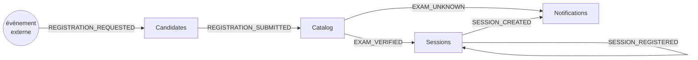

# ericsson-1967

Un *proof of concept* PHP d'une **architecture à blocs et signaux**, inspirée des
autocommutateurs téléphoniques Ericsson de la fin des années 1960 — l'ancêtre de
ce qui deviendra le système AXE et son langage PLEX.

L'idée : aucun code ne décrit le scénario métier. Le comportement **émerge** de la
circulation de signaux nommés entre des équipements fixes.

## Le principe

Trois notions, et rien d'autre :

- **Signal** — un message immuable : un `name` (issu d'un vocabulaire fermé), un
  destinataire nommé (`to`) et des `data` scalaires. **Jamais** d'objet métier à
  l'intérieur, seulement des identifiants et des valeurs.
- **Bloc** (`Block`) — un équipement persistant et **unique**, avec son propre état
  et une seule porte d'entrée (`receive`). Il ne connaît que l'exécutif et le *nom*
  de ses successeurs. Il réagit à un signal en en émettant d'autres (`send`).
- **Exécutif** (`Executive`) — une file de signaux et une table d'adressage. Il
  distribue **sans lire** le contenu : il dépile un signal et appelle la porte
  d'entrée du bloc nommé. Il ignore totalement ce qu'est une « inscription ».

```php
while (! $queue->isEmpty()) {
    $signal = $queue->dequeue();
    $blocks[$signal->to]->receive($signal);   // le cœur de tout le système
}
```

Point clé : il y a **une seule instance de chaque bloc** pour tout le système.
Tous les signaux adressés à `'SESSION'` arrivent sur le même objet `Sessions`, qui
détient l'état — exactement comme un équipement matériel unique traversé par tous
les appels.

## Le scénario d'exemple : l'inscription à un examen

Un candidat demande à s'inscrire à un examen. La chaîne des signaux :



1. `Candidates` vérifie que le candidat existe (`42 => Ada`, `43 => Grace`).
2. `Catalog` vérifie que l'examen existe (`7 => TOEIC`, `8 => IELTS`).
3. `Sessions` crée la session, en tenant un état **par id**, et se confirme à
   lui-même via `SESSION_REGISTERED`.
4. `Notifications` est la seule surface observable : il imprime le résultat.

Aucun de ces blocs n'orchestre le scénario. Chacun ne connaît que le maillon
suivant ; le parcours complet n'existe nulle part sous forme de code.

## Installation

Requiert **PHP ≥ 8.2** et [Composer](https://getcomposer.org/).

```bash
composer install
```

## Lancer la démo

```bash
php run.php
```

Sortie attendue (le `sleep(1)` de l'exécutif fait défiler les signaux un par un) :

```
  → CANDIDATE    REGISTRATION_REQUESTED
  → CATALOG      REGISTRATION_SUBMITTED
  → SESSION      EXAM_VERIFIED
  → NOTIFICATION SESSION_CREATED
    ✉ registration confirmed, session 1
  → SESSION      SESSION_REGISTERED
```

> `run.php` est un **harness de simulation**. Dans un vrai central, il n'existait
> pas de point d'entrée : l'exécutif tournait en permanence et les signaux d'entrée
> naissaient du matériel de scrutation (un abonné qui décroche), pas d'un script.
> Voir les commentaires en tête de `run.php`.

## Lancer les tests

Les tests sont **macro** (bout en bout) : ils injectent un événement d'entrée,
laissent la chaîne se dérouler et observent les notifications imprimées.

```bash
vendor/bin/phpunit
```

## Structure du projet

```
src/
├── Signal.php          # le message immuable (name, to, data)
├── Message.php         # le vocabulaire fermé des signaux (enum)
├── Executive.php       # file + table d'adressage + boucle de distribution
├── Block.php           # classe abstraite : receive() / send()
└── Blocks/
    ├── Candidates.php   # 'CANDIDATE'   — vérifie le candidat
    ├── Catalog.php      # 'CATALOG'     — vérifie l'examen
    ├── Sessions.php     # 'SESSION'     — crée et enregistre la session
    └── Notifications.php# 'NOTIFICATION'— imprime le résultat
tests/
└── ScenarioTest.php    # tests macro du scénario d'inscription
run.php                 # harness de simulation
```

## Choix de conception notables

- **Signaux typés** : `Message` est un `enum` — plus de chaîne libre, les `match`
  des blocs sont vérifiés à la compilation.
- **État par session** : `Sessions` indexe son état par `id` plutôt que par un
  verrou global, ce qui permet de traiter plusieurs inscriptions concurrentes sans
  en abandonner aucune.
- **Découplage total** : un bloc n'importe jamais un autre bloc ; il ne manipule
  que des *noms* de destinataires. La topologie du système vit dans l'exécutif.
